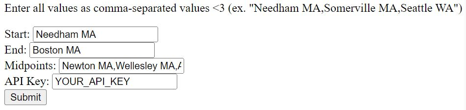

<!-- Maybe split into two routes: local and in Docker? -->
# Finding the shortest multi-stop trip using NoodleMaps
In this tutorial, you will learn how to run and use a web form to find the fastest route between multiple destinations. We assume that you have basic Git knowledge, a GitHub account that is already configured in your local environment, and the `pip` package manager already installed. We also assume that you have your own API key for the Google Maps API.

## Set up your environment
First, you need to set up our repo on your machine. To do this, clone the [NoodleMaps](https://github.com/olincollege/noodlemaps) repository. Then, install its dependencies by navigating to the root directory and running 
```sh
pip install -r requirements.txt
```
in the shell. This will install all the required packages.

## Start the Flask webapp
We used Flask as our framework. Run the following code from the root directory to switch into the `src` directory and start the web app:
```sh
cd src/
python3 -m flask run
```

If this succeeds, you should see the message
```
* Environment: production
   WARNING: This is a development server. Do not use it in a production deployment.
   Use a production WSGI server instead.
 * Debug mode: off
WARNING: This is a development server. Do not use it in a production deployment. Use a production WSGI server instead.
 * Running on http://127.0.0.1:5000
Press CTRL+C to quit
```
Notice that it provides a URL to open in the browser. Follow the link to open the interface, which should display a short description, 4 text entry boxes, and a Submit button.

## Enter your data
The form will ask you for your
1. start location (Start)
2. end location (End)
3. intermediate locations (Midpoints)
4. Google API key (API Key)
as shown in the screenshot below.


For a location, you can put in anything that Google Maps would recognize as a place. For the midpoints, ensure that the locations are separated by a comma, as shown.

Upon pressing the "Submit" button, the form will return your start and end locations, your midpoints in the order that will lead to the shortest total travel time, and the travel time itself. Note that the travel time may not exactly match Google Maps, but the order of the locations will still produce the shortest total travel time. You can then put this information into Google Maps (or any other navigational app)!